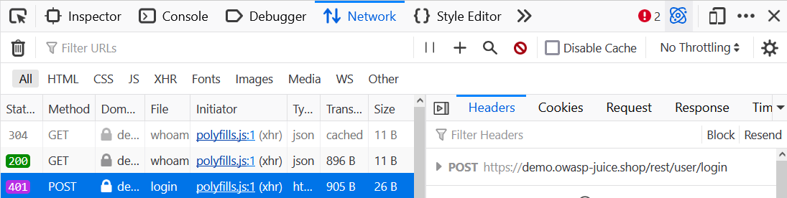
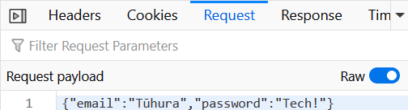

SQL injection is one of the most common web vulnerabilities.
It's one of the easiest attack vectors for a website, and it's even easiest to prevent.

In essence SQL injection is when a user uses a place that accepts user input that searches a database, and then gets something they weren't meant to.

In 2017 the Open Web Application Security Project ([OWASP](https://owasp.org/)) [rated Injection as the most common web application vulnerability](https://owasp.org/www-project-top-ten/), and third most common in 2021. SQL injection is a large portion of injection.

## What is SQL?

SQL, or Structured Query Language, usually pronounced like sequel, is a language used to interact with databases.  
It's used to create, modify, and retrieve data in the database.

SQL is a very simple language to pick up, and it's very easy to learn the basics.  
Take this example:

```sql
SELECT * FROM users WHERE username = 'admin' AND password = 'password';
```

- `SELECT *` is used to select everything from a table.
- `FROM users` is used to select the table `users` from the database.  

So `SELECT * FROM users` selects everything from the users table.

`WHERE` is used to filter the results to only include the conditions following `WHERE`.  
In this case the conditions are the username must be `admin` and the password must be `password`

Altogether this will get all of the users with the username `admin`, and the password `password`. And since it's a login page, it'll likely only return one user.

### Simple injection

The simplest way to inject SQL is to use a single quote `'` in a place that takes user input.  
In an example like the one before, instead of putting `admin` as the username, we're putting `'`, which would make the query look like this:

```sql
SELECT * FROM users WHERE username = ''' AND password = 'password';
```

This is an incorrect query since there are three single quotes, it'll likely throw an error at the user.

We can use this to our advantage though, if we put `' OR 1=1--` as the username, the query would look like this:

```sql
SELECT * FROM users WHERE username = '' OR 1=1--' AND password = 'password';
```

Unlike `'`, this is a valid query.
The `--` is used to comment out the rest of the query, so the `AND password = 'password'` is ignored.

When SQL goes to the database, then goes to the users table, then gets all of the users with the conditions after `WHERE` it'll get all of the users wgeb the following condition is true: the username is `''`, or when `1=1`. Since 1 is always equal to 1, and only it has to be correct due to the OR, it'll always return true for the query from users.

So, depending on how the surrounding code is setup, it'll either return all of the users or the first user, which is often the admin.

Juice Shop is a website designed to be hacked. If we try this on [the demo Juice Shop login page](https://demo.owasp-juice.shop/#/login) by placing `' OR 1=1--` into the username field, we get signed into the admin account.

In case you don't understand try [this hacksplaining exercise on SQL injection](https://www.hacksplaining.com/exercises/sql-injection).

## Sqlmap

There are many, many more injections to try than `' OR 1=1--`, and there are many different types of databases each with their own vulnerabilities.  
Which is where sqlmap comes in, to automate finding the type of database, and testing of different injections.

### Installation

Sqlmap is a python script, so it requires python to run.  
[Download the latest version of python here](https://www.python.org/downloads/), and install it.

Sqlmap is on pip so it can be installed with `python3 -m pip install sqlmap` in your operating system's terminal.

Alturnatively, you can download it [from sqlmap.org](https://sqlmap.org/).  
If you do this you'll need to extract the file and navigate to it with `cd`. Run it with `python sqlmap.py` or `python3 sqlmap.py` instead of `sqlmap`.

### Usage

Sqlmap is a command line tool, so it's used in the terminal.

To use sqlmap, you need to know the URL of the website you're testing, and the place that takes user input.

For example, if we're testing the Juice Shop login page, we'd use `https://demo.owasp-juice.shop/#/login` as the URL, and `username` as the place that takes user input.

To run sqlmap, use `sqlmap -u <URL> --data=<place that takes user input>`.

Go to the [Juice Shop login page](https://demo.owasp-juice.shop/#/login), and open your browser's developer tools. Most browsers use F12 or Ctrl+Shift+I to open the developer tools.

Go to the network tab in the developer tools, and try to login with some random word as the email and password, it doesn't matter.

Here is what the login request looks like in Firefox-based browser LibreWolf:

Here we can see the real request is being made to `https://demo.owasp-juice.shop/rest/user/login` and not `https://demo.owasp-juice.shop/#/login`.

If we go to the Request tab on Firefox-based broswers and toggle Raw, or the Payload tab on Chromium-based browsers and press view source, we can see the important data:

Here we can see the data is being sent as `{"email":"<email>","password":"<password>"}`.

Normally, we would use the -u flag to specify the URL, and the --data flag to specify the place that takes user input. But since the data is being sent as [JSON](https://www.json.org) (you can tell by the curly braces `{}`), for sqlmap we need to use a text file with the request in it.

In Firefox-based browsers like LibreWolf, you can right click on the request (the selected request on the left-side of the first image above) and press Copy Value > Copy Request Headers.  
Unfortunately, Chromium-based browsers don't have this feature. To get the raw request header you'll need to either manually write it down or right click on the request and press Copy > Copy as cURL (cmd) and ask an AI to convert that text to a raw HTTP request header.

Then you can paste the request into a text editor, and save it as `request.txt` in the same directory as the terminal.

Below the header in `request.txt` add `{"email":" * ","password":" * "}`, this is the request body.

The important lines are POST, Host, Content-Type, and the body. Everything else can be removed.

Your `request.txt` file should have contents that look similar to:

```http
POST /rest/user/login HTTP/2
Host: demo.owasp-juice.shop
Content-Type: application/json

{"email":"*","password":"*"}
```

We select the file with the -r flag.  
So the command will look like this assuming the file is in the same directory as the terminal: 

```bash
sqlmap -r request.txt
```

There's one problem with this, which is that sqlmap will stop when it runs into the 401 Unauthorized error code from the website, so we need to add the --ignore-code flag with 401 as the code to ignore.

So the final command will look like this:

```bash
sqlmap -r request.txt --ignore-code=401
```

I recommend you run this to make sure you have everything setup correctly.  
When it asks you the following just reply with 'Y', if it asks you something else there is likely something wrong.

- `custom injection marker ('*') found in POST body. Do you want to process it? [Y/n/q]`
- `JSON data found in POST body. Do you want to process it? [Y/n/q]`
- `it is recommended to perform only basic UNION tests if there is not at least one other (potential) technique found. Do you want to reduce the number of requests? [Y/n]`
It might take a minute or two.

You won't find anything.

The issue is that sqlmap isn't testing enough. To test more we need to use the --level flag. By default the level is at 1, so let's try 2.

```bash
sqlmap -r request.txt --ignore-code=401 --level=2
```
