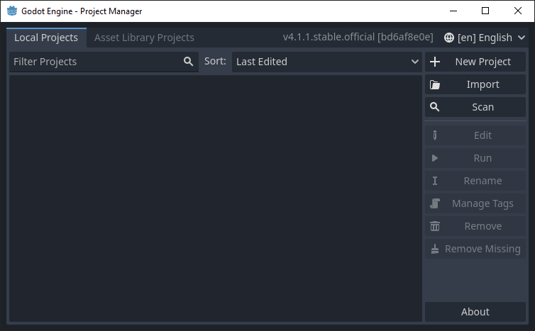
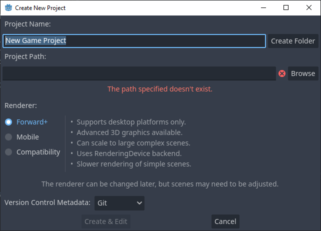
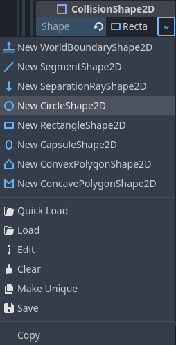
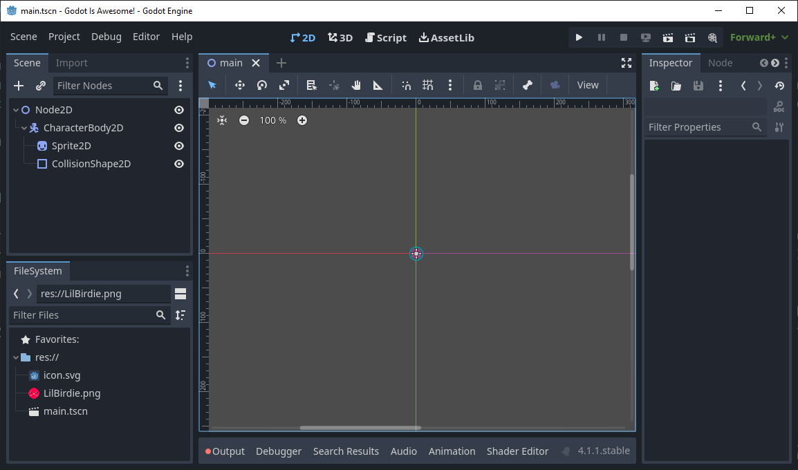
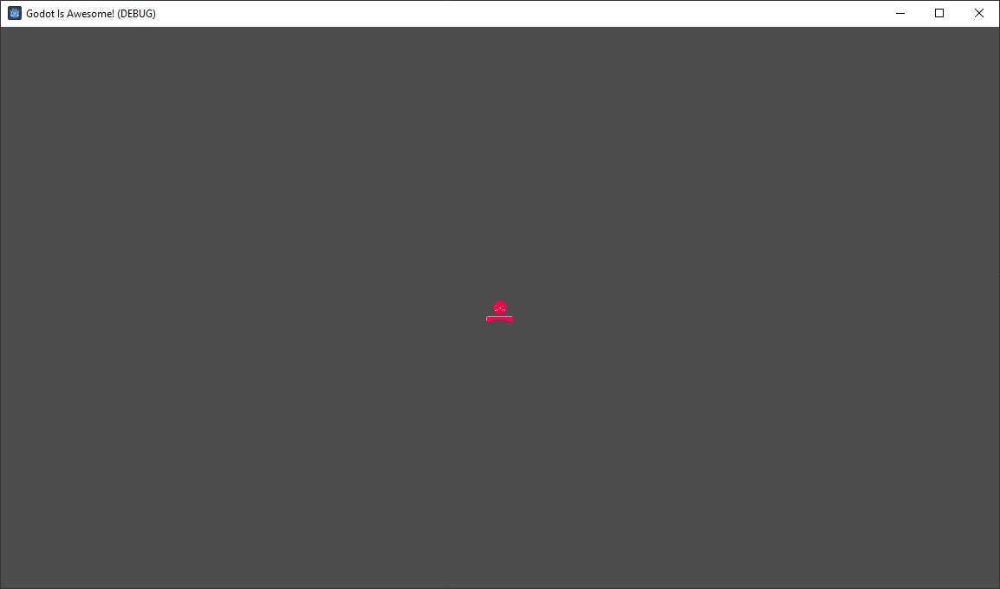

[Godot](https://godotengine.org/) is a free and open source game engine that supports game design for 2D and 3D games. It is a great tool for beginners and experts alike. It is also a great tool for teaching game design and programming. This guide will help you get started with Godot and teach you how to make a simple 2D game.

This guide is up-to-date with Godot 4.1.1 stable official release.
# Getting started
There are several options for developing with Godot. The recommended way is to download the latest version from the [downloads page](https://godotengine.org/download/) for Windows/macOS/Linux. It will be what we use for this guide.

- Run the engine in a web browser with the [Godot Web Editor (v4.1.1)](https://editor.godotengine.org/releases/4.1.1.stable). This is the easiest way to get started, but it has [documented limitations](https://docs.godotengine.org/en/stable/getting_started/editor/web_editor.html#limitations) and is not recommended for large projects.
- Download the android app from the [Google Play Store](https://play.google.com/store/apps/details?id=org.godotengine.editor.v4), while functional it is in early access and may not be stable.
- (Recommended) Download the latest version from the [downloads page](https://godotengine.org/download/) for your platform to run locally. Extract the zip file and run the executable. You should see a window similar to this:


A version of the engine that uses C# is also available. It is not recommended for beginners, but if you are familiar with C# it may be a better option for you. You can download it from the [downloads page](https://godotengine.org/download/) for your desktop platform. However, it is not available for use in the web editor or the android app. 

## Creating a project
### Making a new project
Click the **New Project** button to create a new project, the following window will appear:


**Project Name:**
This is the name of your project, it can be anything you want. For this guide, we will use **Godot Is Awesome!**.
You can use the **Create Folder** button to create an empty folder with the name of your project at the project path.  
**Project Path:**
This is the path to the folder where your project will be stored.
You can use the **Browse** button to select a folder or type in the path manually.
It is recommended you use an empty folder for your project.  
**Renderer:**
Godot has three renderer presets: Forward+, Mobile, and Compatibility.
For this guide, we will use the **Forward+** preset.
Forward+ is only good for desktop platforms and has the most features.
Mobile is best for mobile platforms, but supports desktop, and has fewer features with better performance.
Compatibility supports desktop, mobile, and web platforms, it has the fewest features and the best performance. It is not recommended to use compatibility for 3D projects.  
**Version Control Metadata:**
This is used to store version control information in the project folder. It is recommended to leave this on Git even if you are not using version control. It is also recommended to use version control for your projects, but it is not required.  

### 2D or 3D?
The next window that'll open is the meat of the game engine, it is where you make your actual game. At first, it can be a little daunting, all the buttons and docks, but it's simple to understand once you've used it a bit.

For now, decide if your project will be 2D or 3D. You can change this later, but it's easier to start with the right one for your project.
For this guide, we will use 2D to introduce all the key concepts.  

### The interface
The interface is made up of several docks and buttons. The most important ones are the Scene dock (top left), the Inspector dock (right), and the FileSystem dock (bottom left).  

The four main screens of Godot are the 2D screen, the 3D screen, the Script screen, and the AssetLib screen. You can switch between them with the buttons at the top of the screen.

## Components of a game
At the top left under **Create Root Node:** click the **2D Scene** button. This will create a new scene with a **Node2D** root node.


This should be the core scene of your game, or the scene that you do the core of your development in.  
At any time save your scene with **Scene > Save Scene** or save all scenes with **Scene > Save All Scenes**, we saved the scene as **main.tscn**.

### Nodes
Nodes are the building blocks of your game. They are the objects that make up your game. They can be anything from a sprite to a camera.
Nodes are organized in a tree structure, with the root node at the top and child nodes below it. Nodes can have any number of child nodes, but only one parent node.
You can see all the types of nodes with the Add Child Node button in the top left of the Scene dock, or by right-clicking any node in the Scene dock and selecting **Add Child Node**.  
It's worth taking a look at your options, but for now we'll start with CharacterBody2D. It can be hard to find since it's nested inside several nodes, but you can search for it in the bar. 

The CharacterBody2D is a node designed for objects that interact with physics that will be controlled by the player.
You'll notice it has a warning icon next to it, go ahead and add both the Sprite2D and CollisionShape2D nodes as children to the CharacterBody2D node.  
Now the CollisionShape2D node has a warning icon, this is because it needs a shape to define its collision. On the right side of the screen you'll see the Inspector tab, this is where you can edit the properties of the selected node. Select the CollisionShape2D and change the first property, the shape, to a **New CircleShape2D**.


Similarly, on the Sprite2D node, you can change the texture property to a new texture. Save the little birdie image below to your device with **right-click > Save Image As...** and drag it into the FileSystem tab in the bottom left of the screen, alternatively you can make your own image and use that. Once it's in the FileSystem tab, you can drag it into the texture property of the Sprite2D node. 

If you want to make your own pixel art similar to this to expand your game later, use the [PICO-8 palette](https://lospec.com/palette-list/pico-8).

Your scene should now look something like this:


In the viewport, the largest area of the screen that shows the scene, you can move around with the middle mouse button and zoom in and out with the scroll wheel.
Zooming into the small circle where the red and green lines meet, you might notice the pixelated texture is fuzzy. This is because the texture is being scaled up to fit the size of the sprite. To fix this, go to the Sprite2D node and change the property **CanvasItem > Texture > Filter** to **Nearest**. Only do this for pixel art textures.
In the future, if you do not want to change the Filter property for every Sprite2D node, you can change any parent node's Filter property to Nearest and all child nodes will inherit it if their Filter property is set to Inherit.

### Scenes
Scenes are collections of nodes that make up a part of your game. They can be anything from a single node to a complex hierarchy of nodes. Scenes can be saved as files and reused in other scenes.

For example, it's good practice to have your player character in its own scene, so you can reuse it in other scenes. This is especially useful if you have multiple levels in your game, you can reuse the player character scene in each level scene. You can convert the current CharacterBody2D node into a scene by right-clicking it and selecting **Save Branch as Scene**. Save it as **player.tscn**, also rename the node from **CharacterBody2D** to **player** by double-clicking the name. Now if you want to edit the child nodes of your player character, you can open the player.tscn scene by clicking the new **Open in Editor** button next to the player node in the Scene tab. You can also open the scene by double-clicking the player.tscn file in the FileSystem tab.

Go ahead and open the player scene and add the Camera2D node as a child to the CharacterBody2D node. This will make the camera follow the player character. You can also turn on **Position Smoothing > Enable** in the Camera2D node's properties to make the camera movement smoother. Save the player scene. Above the viewport you can go back to the main scene by clicking the tab called the name of your main scene. 

Start your magnificent game by clicking the **Run Project** button in the top right of the screen or by pressing F5. You should see a window like this:

Press **Select Current** if you are in your main scene. Now your gorgeous game should be running! Let's get some interaction in there.

### Scripts
Scripts are what make your game do things. They are written in GDScript, a language similar to Python if you squint hard enough.
As mentioned before, you can write scripts in C# as well, but it is not recommended for beginners. If you are familiar with C# you can use the [C# documentation](https://docs.godotengine.org/en/stable/tutorials/scripting/c_sharp/index.html) to help you write your scripts.

#### Making a new script
To add a script to a node, select the node and **right-click > Attach Script** or press the **Attach a new or existing script to the selected node.** button above the hierarchy. For now, add a script to the player node, it will open a new window that looks like:


**Language:**
This is the language you want to write your script in, for this guide we will use GDScript, and it will most likely be the only one you have available.  
**Inherits:**
This is the class that the script will inherit from, the player should inherit from CharacterBody2D.  
**Class name:**
Seemingly it does not change nor can you change it. Unsure as to its purpose.  
**Template:**
This is a template for the script, often you might want to the default node or empty object, but for this character we will use the **CharacterBody2D: Basic Movement** template since it has basic functions you might want for your player already setup.  
**Built-in Script:**
Built in scripts don't make a separate file for the scripts, they are stored within the node. This is useful for small scripts that you don't want to make a separate file for just to keep things clean, but it is not recommended for larger scripts or scripts that will be used by multiple nodes. For the player, we will not use a built-in script.  
**Path:**
This is the path to the script file. If you are not using a built-in script, it will be replaced by a **Name:** field. For the player, we will use the default path `res://player.gd`. It is a good idea to make a folder just for scripts or just for scenes to make organization easier, but for this small project this is easier.

Click **Create** and you should see a new script window open. It should look like this:

You can make the script take up the whole window with the full-screen icon in the top right, and if you have a console open, you can close it by pressing **Output** at the bottom of the screen.

Now if you run the game with **F5** the player should fall down. If you haven't attached a Camera2D component to the player, it will just drop down on one side of the screen. If you attached a Camera2D component but haven't enabled the property **Position Smoothing**, then the player will drop, but the camera will stay stuck to it like glue, and it will look like the player isn't moving at all. If you have an attached Camera2D component on the player and have enabled **Position Smoothing**, then the player will drop, and the camera will follow it until the player gets too fast for the camera. If you're fast enough, you can move the player left and right with the left and right arrow keys before the player drops off-screen.

#### Adding a platform 
For the sake of testing, let's add a platform the player can jump around on.  
In the Scene dock on the main scene, add **StaticBody2D** as a child node to Node2D. Add **Sprite2D** and **CollisionShape2D** as child nodes to **StaticBody2D**. Give the sprite the pixel art below this paragraph, the same way you did the player. If you didn't set Node2D's property **CanvasItem > Texture > Filter** to **Nearest** then you'll need to set the sprite's Filter property to **Nearest**. Set the collision shape's shape to **RectangleShape2D**. If you switch from the Script screen to the 2D screen and select the collision shape, you can adjust the size with the eight orange dots, make the collider the same shape and size as the pixel art. Next, select the StaticBody2D node and press **W** or the **Move Mode** button at the top of the viewport, the second button from the left. Use the green arrow to move the node and its child nodes down, so it's below the player. Press **Q** or the **Select Mode** to return to a regular cursor. 


When running, your game should now look something like this:

You can move around with arrow keys and jump with space, if you fall off your player will fall out of the screen.

Make the platform larger, so you have more space to move around and test on with the **Scale Mode** button at the top of the viewport, the third button from the left or by pressing **S**. Select the StaticBody2D node and drag in the viewport to make the platform larger. Hold **Shift** while scaling to scale the node evenly. You may need to move the platform around more, use move mode again to move it. Return to a regular cursor with select mode after you have finished. You can make the player larger if you want to as well, if you do the gap between the player and the platform will be larger, so you may need to adjust the size of the collider in the player scene to be the same size as the sprite.

#### Modifying the default script
If you have never programmed before, it is recommended you start with a simple language like [Scratch](https://scratch.mit.edu/projects/editor/?tutorial=getStarted). 
If you are familiar with programming, but not GDScript, you can use the [GDScript documentation](https://docs.godotengine.org/en/stable/getting_started/scripting/gdscript/gdscript_basics.html) to help you write your scripts.

The default script that came with CharacterBody2D should look like this:
```gdscript
extends CharacterBody2D


const SPEED = 300.0
const JUMP_VELOCITY = -400.0

# Get the gravity from the project settings to be synced with RigidBody nodes.
var gravity = ProjectSettings.get_setting("physics/2d/default_gravity")


func _physics_process(delta):
	# Add the gravity.
	if not is_on_floor():
		velocity.y += gravity * delta

	# Handle Jump.
	if Input.is_action_just_pressed("ui_accept") and is_on_floor():
		velocity.y = JUMP_VELOCITY

	# Get the input direction and handle the movement/deceleration.
	# As good practice, you should replace UI actions with custom gameplay actions.
	var direction = Input.get_axis("ui_left", "ui_right")
	if direction:
		velocity.x = direction * SPEED
	else:
		velocity.x = move_toward(velocity.x, 0, SPEED)

	move_and_slide()
```
There are some simple things you can do without adding or removing lines of code. 
- Change the fields at the beginning of the script, SPEED and JUMP_VELOCITY. What they do should be self-explanatory, try changing the numbers after the `=` and running the game until you get something that you like the feel of. 
- Change the gravity by going to **Project > Project Settings** then in the **General** tab, **Physics > 2D > Default Gravity**. You can also change the gravity in the script by changing the line `var gravity = ProjectSettings.get_setting("physics/2d/default_gravity")` to `var gravity = n` where n is a number of your choice.
- Change the input keys by going to **Project > Project Settings** tab **Input Map** and pressing **Show Built-in Actions**. By looking at the script we can see it is using the actions **ui_accept**, **ui_left**, and **ui_right**. If you want to use WASD instead of the arrow keys, scroll until you find the **ui_left** action, then double-click the **Left** input and press **A** on your keyboard and then press **OK**. Do the same for **ui_right** with **D**. 

Some unclear things about GDScript that are good to know:  
- `extends CharacterBody2D` means that this script inherits from **CharacterBody2D**, so it has all the functions and variables that **CharacterBody2D** has, which extends from **PhysicsBody2D**, which extends from **CollisionObject2D**, and so on until it reaches the root node **Object**. This script has access to every single function and variable from each of those nodes!
- Functions that start with an underscore, like `_physics_process`, are called automatically by the engine.
- You can use **CTRL + Click** on Windows or **⌘ + Click** on macOS to go to the definition of a function or variable. This is useful for seeing what a function does.
- Multiply a variable by `delta` in the `_physics_process` function to make it framerate independent. This is useful for making sure your game runs at the same speed on different devices. For example, if you want to move a node 100 pixels per second, you would multiply the velocity by `delta`, which is the time between the previous frame and this one measured in seconds: `velocity.x += 100 * delta`. This is to make it so that when enough frames have passed so that 1 second has passed, it would've been `100 * 1` but spread out across tens of frames to make the motion smooth instead of increasing the velocity by 100 pixels every frame, which is absurdly fast and may be faster or slower on different monitors or devices. 
- `move_and_slide()` uses the velocity of the node to calculate where the node should move to on this frame, which is why you don't need to give it any parameters and run it after you have calculated the velocity.

For a good introduction to writing your own scripts to control nodes, see the [Godot documentation](https://docs.godotengine.org/en/stable/getting_started/scripting/gdscript/gdscript_basics.html). At any time, you can also use the **Search Help** button in the top right of the Script screen to look up any function or variable.

If you have followed this entire guide, you know enough terminology and technique to make almost any 2D game! You will definitely need to look things up and reference the documentation, no one stops using google, but the more you create, the more you will develop muscle memory and gain understanding. 3D games aren't much more difficult, just have a different way of doing things.