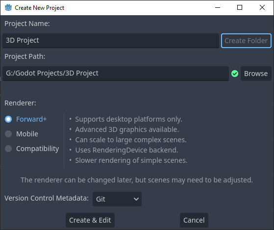
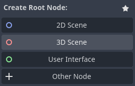
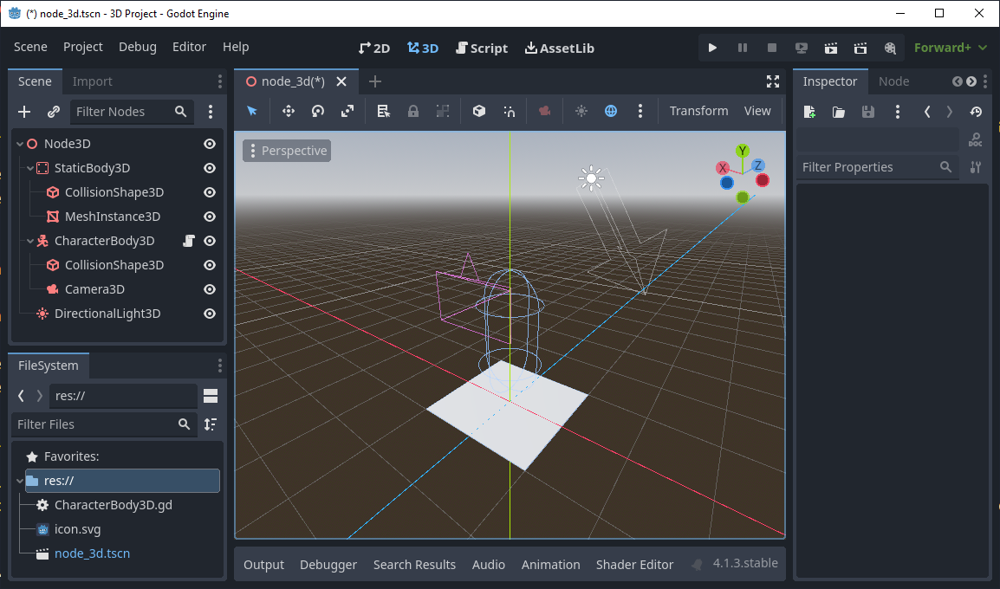
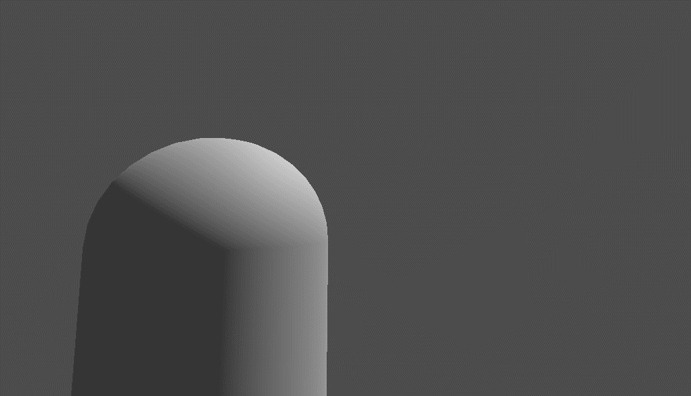

This is a guide for making a 3-dimentional game in [Godot](https://godotengine.org/). If you are unfamiliar with Godot check out the [Godot basics](../basics) doc.

:::note[Version]
This guide is up-to-date with Godot 4.1.3 stable official release but will most likely work with any 4.x release.
:::

### Setting up

#### Making the project

Making the project is just as easy as 2D.


Make sure your project is set to Forward+. 

:::note[Different renderers]
In 2D what renderer you choose has minimal effect on your final outcome due to how simple 2D images are to draw to a screen. With 3D there is a large disparity between the renderers. Read the notes next to each renderer before picking something other than Forward+.
:::



Set the root node to 3D and you're project is setup!  
Although go ahead and save the scene with Scene > Save Scene so you have the scene file saved.

### Making the player

Before adding things to your scene you should know how to move around in the viewport.  
Press down the middle mouse button to rotate the camera. Zoom in and out by scrolling. Shift+Middle Mouse to pan. Right click to turn and while right click is down you can press WASD-QE to fly. Press F to recentre the camera on the selected object.  
:::note[Devices without a middle mouse button]
If you do not have a middle mouse button to press, go to Editor > Editor Settings... > Editors > 3D and turn Emulate 3 Button Mouse on. Now you will use Alt to rotate and Shift to pan.
:::

First, you're going to want to setup a platform for the player to stand on.

Simply add a StaticBody3D as a child of Node3D.
Then, add MeshInstance3D and CollisionShape3D as a child of StaticBody2D.
In the inspector on the right set MeshInstance3D's 'Mesh' property to New PlaneMesh.
Set the CollisionShape3D's 'Shape' property to New BoxShape3D.
Select CollisionShape3D and use the orange dots to shape the BoxShape3D to the same shape and size as the plane. 

Now, as a child of Node3D add CharacterBody3D.
Add as a child of CharacterBody3D a Camera3D and CollisionShape3D.
Set the collision shape to capsule.
Select the CharacterBody3D and move it up in the viewport until it's on top of the plane.
Move the camera up so it's where the 'head' should be on the character.
Give the CharacterBody3D a script and leave it as the default template script.
One final step, add a DirectionalLight3D as a child of Node3D and rotate it to point down, this can be anywhere in the scene.

Your scene should look something like this:

Now when you play the game and press **down** on the arrow keys you should move backwards off the platform and fall off, you should see the platform briefly as you fall.

Most modern 3D games have a first person camera, which can be pretty complicated. Open the script on your player.
In this script add these lines below `var gravity` and above `func _physics_process(delta):`:
```gdscript
# Get the player camera
@onready var main_camera := $Camera3D

# Make the camera variables
var camera_rotation = Vector2(0, 0)
var mouse_sensitivity := 0.005


func _ready() -> void:
	# Remove the mouse from the screen and just capture its movement
	Input.set_mouse_mode(Input.MOUSE_MODE_CAPTURED)


func _input(event) -> void:
	# If escape is pressed reveal the mouse
	if event.is_action_pressed("ui_cancel"):
		Input.set_mouse_mode(Input.MOUSE_MODE_VISIBLE)
	
	# Get the mouse movement
	if event is InputEventMouseMotion:
		# Get how much the mouse has moved and pass it onto the camera_look function
		var mouse_event = event.relative * mouse_sensitivity
		camera_look(mouse_event)

# Rotate the camera
func camera_look(movement: Vector2) -> void:
	# Add how much the camera has moved to the camera rotation
	camera_rotation += movement 
	# Stop the player from making the camera go upside down by looking too far up and down
	camera_rotation.y = clamp(camera_rotation.y, deg_to_rad(-90), deg_to_rad(90)) 
	
	# Reset the transform basis
	transform.basis = Basis()
	main_camera.transform.basis = Basis()
	
	# Finally rotate the object, the player and camera needs to rotate on the x and only the camera should rotate on the y
	rotate_object_local(Vector3.UP, -camera_rotation.x)
	main_camera.rotate_object_local(Vector3.RIGHT, -camera_rotation.y)
```
:::note[Understanding the code]
If you want to understand this code past reading the comments, you should read the Godot docs on [Using Transforms](https://docs.godotengine.org/en/stable/tutorials/3d/using_transforms.html). Then try making a third-person camera! (A camera that hovers behind the shoulder of the player) You will need to add a capsule mesh to the CharacterBody3D so the player is visible. Keep in mind the y rotation shouldn't be centered on the camera but on the player's head.  
Here's an example of what it should look like:

:::
The mouse sensitivity variable controls how fast the camera moves, change it to suit your preference.

This is all you need for a basic character controller, but, as is good practice, you should change the input keys.

Go to Project > Project Settings... > Input Map and in `Add New Action` add 'forward', 'left', 'backward', 'right', and 'jump'.
Press the plus button next to each one and press the key you would like them to be.  
It is recommended 'forward' should be W, 'left' should be A, 'backward' should be S, 'right' should be D, and 'jump' should be spacebar.
In your script replace 'ui_up' with 'forward', 'ui_left' with 'left', 'ui_down' with 'backward', 'ui_right' with 'right', and 'ui_accept' with 'jump'.

'ui_cancel' does not need to be changed since it would be the key you press to exit anyway.