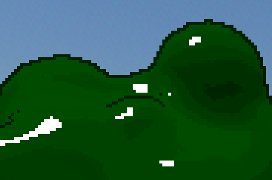

This page is for creating specific types of games in Godot. This guide will assume you have gone through the basics page and understand the core concepts.

We won't go through a lot of the simple things like where to find buttons, how to setup a project, etc.

Also, all nodes will be renamed appropriately in all screenshots, they will not be the original names of the nodes. We recommend you rename your nodes as well.

## Universal features

To skip explaining this throughout every genre, there are some unchanging features nearly every single game has.

Primarily these will be flexible and done in different ways for the game, and some artful games totally forgo some, or any, of these staples of the medium.

But this isn't about how there always has to be a character controller of some variety. Character controllers come in all shapes and sizes.

This is about things like the main menu, settings, mapping inputs, and things of the sort. These are very rarely done differently, aside from the layout and aesthetics.

### Main menu

Main menus are nigh universal traits. They are usually the same formula copied and slightly twisted to fit aesthetic.

#### Setting up

Make a new scene and make the root node a **Control** node, listed as **User Interface**.

For this we'll need the node tree:
- **Control** - Root node
	- **ColorRect** - The background
	- **RichTextLabel** - The title
	- **VBoxContainer** - Holds the buttons
		- **Button** - Start button
		- **Button** - Settings button
		- **Button** - Quit button

Select your **ColorRect** first. On the right of your toolbar at the top of the viewport, there should be the option to set the anchor preset.

For the background **ColorRect** this should be **Full Rect** so it takes up the whole screen. The same should be true for your **Control** node. Your **RichTextLabel**, and **VBoxContainer** should connect to part of the screen they should move with when the **Control** node is resized. This is important so that when people with different aspect ratios on their screen play your game it resizes properly. It's similar to making a responsive website. 

Move your title to the place you want your title and make the box large enough for the text. In the inspector set the text to the title of your game. Next, go to **Control > Theme Overrides > Colors > Default Color** and turn it on. Your text may have been white on the white background and not visible before, this will change it to the black color. You can change the value of the default color. Finally, in **Control > Theme Overrides > Font Sizes > Normal Font Size** turn it on and make the text larger.

Do the same things for your three buttons. You can select all three buttons with shift/ctrl + click and do them all at once. The text will need to be set separately.

The **VBoxContainer** node stacks all of its children nodes in a **V**ertical **Box**.

Make it wide and tall enough to contain the buttons, position it properly. Your buttons should be there.

User interfaces in games are a bit finicky due to the fact that not all screens are build equal. Some people have ultra-wide monitors, some people play games on old CRT screens. Making your game accessible is paramount.

#### Interaction

It's good practice to separate functions into as many files as you can. This is helpful keeping tidy, working with people using Git, and several other benefits. It's for this reason we'll use a short and separate script for each of the buttons. And just so we don't clutter up your scripts folder, we'll use built-in scripts which are stored in the .tscn file for your scene instead of a .gd file.

Give your start button a script, toggle built-in, and make it. Delete everything other than `extends Button`. Connect the start button's `pressed()` signal to its own script and set the function's body to `get_tree().change_scene_to_file("res://scenes/main_menu.tscn")`. Replace `res://scenes/main_menu.tscn` with the path to the first level, the main scene, or whatever scene you would normally open to play your game. If you're starting with just a main menu you can set this later. Make sure to press play or **F5** and set the current scene as the scene it loads up when you play the game.

:::note[Faster loading]
It's a good idea to use `get_tree().change_scene_to_packed()` instead. The only difference is you need a global variable along the lines of `var main_scene = preload("res://scenes/main_menu.tscn")`, of course with the main menu scene switched out for your main one. Then give that as a variable in the method in your function body with `get_tree().change_scene_to_packed(main_scene)`.

This causes Godot to load the scene before you press the button, instead of loading the scene after you press the button. It's faster and more responsive for your player.
:::

Your quit button is just as easy. Make a script, connect the signal. This time in the function body give it `get_tree().quit()`.

The settings button requires a settings menu.

### Settings

If you just made your main menu with the above guide, click the eye icon on your button container and the title label.

#### Setting up

As a child of your **Control** node, add **TabContainer**. We will provide examples for changing video, audio, and controls. But you will have to think of and provide settings for the gameplay since it's all about your unique game.

Make sure to anchor your **TabContainer** to **Full Rect** so it takes up the whole screen.

Add this:
- **TabContainer** - Contains the tabs
	- **TabBar** - Video tab
		- **VBoxContainer** - Lists the options vertically
			- **HBoxContainer** - Holds the label and the option for the setting
				- **Label** - Tells the name of the setting
				- **VSeparator** - Vertical separator between the label and the option
				- **OptionButton** - Lets the user decide between 2D MSAA
				- **OptionButton** - Lets the user decide between 3D MSAA
				- **CheckBox** - Lets the user to decide if to use screen space FXAA
				- **Checkbox** - Lets the user decide if to use TAA
	- **TabBar** - Audio tab
		- **VBoxContainer** - Lists the options vertically
			- **HBoxContainer** - Holds the label and the option for the setting
				- **Label** - Tells the name of the setting
				- **VSeparator** - Vertical separator between the label and the option
				- **HSlider** - Lets the user change the volume
	- **TabBar** - Gameplay tab
	- **TabBar** - Controls tab
		- **VBoxContainer** - Lists the options vertically
			- **HBoxContainer** - Holds the label and the option for the setting
				- **Label** - Tells the name of the setting
				- **VSeparator** - Vertical separator between the label and the option
				- **Button** - Lets the user change the related button

A lot of this is very similar. You can just make one **TabBar** and its children, then copy paste it onto the **TabContainer** three times. If you do this make sure to change the related **Label**'s text and also change the node the user selects to the related type for the setting.

You must rename the **TabBar** nodes to change the title of the tabs.

#### Anti-Aliasing

Godot has some good documentation for both [2D](https://docs.godotengine.org/en/stable/tutorials/2d/2d_antialiasing.html) and [3D](https://docs.godotengine.org/en/stable/tutorials/3d/3d_antialiasing.html) anti-aliasing. But the quick and short of it is: anti-aliasing is removing the stepping of pixels through a few different methods. 

For example, in this game with a pre-set low resolution we can clearly see that this Start button has lots of pixels with a lower opacity than the main lines.

At this zoomed in it looks blurry but to our eyes when it's not so close up it looks smoother than is there were no anti-aliasing on the text.

Now look at this harshly outlined bush from the same game:

Around the edges where the outline meets the sky we can see it's all a single, solid color. This is what it looks like when something is aliased. Of course this is also very zoomed in, the effect is less apparent when zoomed out but it's still very noticeable and annoying.

There are many ways of combating this effect, Godot has a few built-in. Sometimes you may not want to fight the effect at all and just have it to give a retro-style like the above game which has a forced resolution of 512x240.

We'll let the player choose between the built-in Godot ones.

##### Making the option

For both MSAA nodes, give it the options Disabled, 2x, 4x, and 8x. Of course you can remove the irrelevant 2D or 3D one if you know what your game is going to be.

If you plan to have the default settings be more than just all disabled, you can change the **Selected** property for the **OptionButton**s, and the **Button Pressed** property for the **CheckBox**s to match your default.

Add a script to the **VBoxContainer** on the video tab and call it something like `setting_anti_aliasing.gd` in a scripts folder.

Navigate to **Project > Project Settings... > Rendering > Anti Aliasing**. This is where you can see all the options. You might recall you made two **CheckBox**s, but this screen has only one and three **OptionButton**s. Well if you select **Screen Space AA** you can see there are only **Disabled** and **FXAA**.

From here you can right click and copy the path to the setting, this is what we'll use to set the setting.

Now, in your script get all four option nodes in your script. A good way to do this is to click and drag your node onto the script, and before you let go on an empty line press **Ctrl**. This will make the entire variable for you, instead of just dragging in `$"path/to/variable"`.

Next, connect the `item_selected(index: int)` or the `toggled(toggled_on: bool` signals from all four option nodes.

## Bullet heaven

Bullet heaven games are distinctly the opposite of the ever-popular bullet hell genre.

The player slowly accumulates a variety of abilities that activate automatically and fire an absurd amount of bullets at an equally absurd amount of enemies that slowly advance towards the player.

Bullet heaven games are usually from a top-down perspective.

The genre initially got popular from the Unity game Vampire Survivors.  
Although one of the most well-known Godot games, Brotato, has seen a good amount of fame after the popularity of Vampire Survivors brought attention to the concept of a bullet heaven.

For this we will make a simple 2D top-down character controller. A selection of abilities that fire projectiles periodically. Enemies that spawn outside of the screen and then slowly advance towards the player. Finally, a health and score system.
