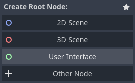
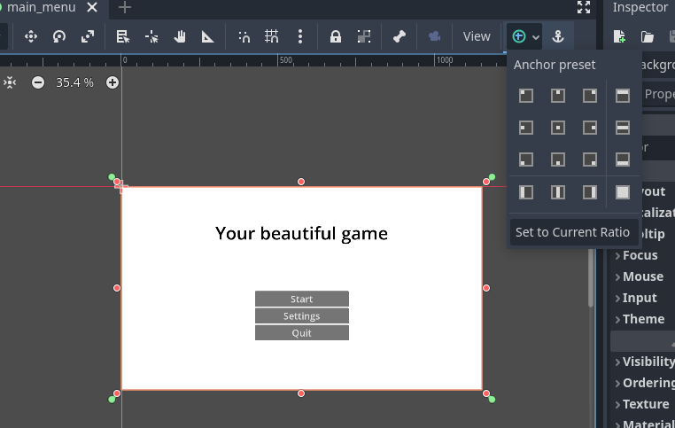
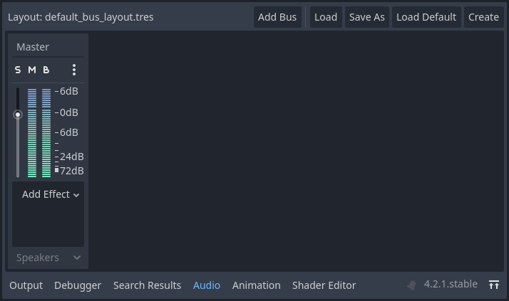

This page is for creating specific types of games in Godot. This guide will assume you have gone through the basics page and understand the core concepts.

We won't go through a lot of the simple things like where to find buttons, how to set up a project, etc.

Also, all nodes will be renamed appropriately in all screenshots, they will not be the original names of the nodes. We recommend you rename your nodes as well.

## Universal features

To skip explaining this throughout every genre, there are some unchanging features nearly every single game has.

Primarily these will be flexible and done in different ways for the game, and some artful games totally forgo some, or any, of these staples of the medium.

But this isn't about how there always has to be a character controller of some variety. Character controllers come in all shapes and sizes.

This is about things like the main menu, settings, mapping inputs, and things of the sort. These are very rarely done differently, aside from the layout and aesthetics.

### Main Menu

Main menus are nigh universal traits. They are usually the same formula copied and slightly twisted to fit the aesthetic.

#### Setting up

Make a new scene and make the root node a **Control** node, listed as **User Interface**.



For this, we'll need the node tree:
- **Control** - Root node
	- **ColorRect** - The background
	- **RichTextLabel** - The title
	- **VBoxContainer** - Holds the buttons
		- **Button** - Start button
		- **Button** - Settings button
		- **Button** - Quit button


#### Anchors

Tons of people have differently sized screens; not everyone has a 16:9 aspect ratio monitor. For this reason we need anchors, it's similar to designing a responsive website.

Select your **ColorRect** first. On the right of your toolbar at the top of the viewport, there should be the option to set the anchor preset.


The background **ColorRect** should be set to **Full Rect** so it covers the default background and resized to cover the entire background no matter the aspect ratio. Feel free to change the **ColorRect**'s color.

The **RichTextLabel** should bCleanup e connected to the part of the screen they'll move with when the screen is resized. In the anchor preset menu, select the closest one to where you want it to be, then move the nodes to be roughly where you want them to be.

Test out moving them around by selecting your **Control** node and resizing it with the orange dots.

In the inspector of **RichTextLabel**, set the text to the title of your game. Next, go to **Control > Theme Overrides > Colors > Default Color** and turn it on. Your text may have been white on the white background and not visible before, this will change it to the black color. You can change the value of the default color. Finally, in **Control > Theme Overrides > Font Sizes > Normal Font Size**, turn it on and make the text larger.

Do the same things for your three buttons. You can select all three buttons with shift/ctrl + click and do them all at once. The text will need to be set separately.

The **VBoxContainer** node stacks all of its children nodes in a **V**ertical **Box**.

Make it wide and tall enough to contain the buttons, anchor and size it properly. Your buttons should be there.

User interfaces in games are a bit finicky due to the fact that not all screens are built equal. Some people have ultra-wide monitors, some people play games on old CRT screens. Who knows, maybe someone will play your game in their brain one day. Making your game accessible is paramount.

#### Interaction

It's good practice to separate functions into as many files as you can. This is helpful for keeping tidy, working with people using Git, help remind future-you what now-you were thinking, and just generally be easier. It's for these reasons, we'll use a short and separate script for each of the buttons. And just so we don't clutter up your scripts folder and we'll never touch these again, we'll use built-in scripts which are stored in the `.tscn` file for your scene instead of a separate `.gd` file.

Give your start button a script, toggle built-in, and make it. Delete everything other than `extends Button`. Connect the start button's `pressed()` signal to its own script and set the function's body to `get_tree().change_scene_to_file("res://scenes/main_menu.tscn")`. Replace `res://scenes/main_menu.tscn` with the path to the first level, the main scene, or whatever scene you would normally open to play your game. If you're starting with just a main menu you can set this later. Make sure to press play or **F5** and set the current scene as the scene it loads up when you play the game.

:::note[Faster loading]
It's a good idea to use `get_tree().change_scene_to_packed()` instead. The only difference is you need a global variable along the lines of `var main_scene = preload("res://scenes/main_menu.tscn")`. Of course with the main menu scene switched out for your game's starting scene. Then give that as a variable in the method in your function body with `get_tree().change_scene_to_packed(main_scene)`.

This causes Godot to load the scene into memory before you press the button, instead of loading the scene after you press the button. It's faster and more responsive for your player.
:::

Your quit button is just as easy. Make a script, connect the signal. This time in the function body give it `get_tree().quit()`.

The settings button requires a settings menu.

### Settings

If you just made your main menu with the above guide, click the eye icon on your button container and the title label.

#### Setting up

As a child of your **Control** node, add **TabContainer**. We will provide examples for changing video, audio, and controls. But you will have to think of and provide settings for the gameplay since it's all about your unique game.

Make sure to anchor your **TabContainer** to **Full Rect** so it takes up the whole screen.

Add this as a child of the root node:
- **TabContainer** - Contains the tabs
	- **TabBar** - Video tab
		- **VBoxContainer** - Lists the options vertically
			- **HBoxContainer** - Holds the label and the option for the setting
				- **Label** - Tells the name of the setting
				- **VSeparator** - Vertical separator between the label and the option
				- **OptionButton** - Lets the user decide between 2D MSAA
				- **OptionButton** - Lets the user decide between 3D MSAA
				- **CheckBox** - Lets the user decide if to use screen space FXAA
				- **Checkbox** - Lets the user decide if to use TAA
	- **TabBar** - Audio tab
		- **VBoxContainer** - Lists the options vertically
			- **HBoxContainer** - Holds the label and the option for the setting
				- **Label** - Tells the name of the setting
				- **VSeparator** - Vertical separator between the label and the option
				- **HSlider** - Lets the user change the volume
	- **TabBar** - Gameplay tab
	- **TabBar** - Controls tab
		- **VBoxContainer** - Lists the options vertically
			- **HBoxContainer** - Holds the label and the option for the setting
				- **Label** - Tells the name of the setting
				- **VSeparator** - Vertical separator between the label and the option
				- **Button** - Lets the user change the related button

A lot of this is very similar. You can just make one **TabBar** and its children, then copy-paste it onto the **TabContainer** three times. If you do this, make sure to change the related **TabBar** names and the option nodes.

You must rename the **TabBar** nodes to change the title of the tabs.

#### Video: Anti-Aliasing

Godot has some good documentation for both [2D](https://docs.godotengine.org/en/stable/tutorials/2d/2d_antialiasing.html) and [3D](https://docs.godotengine.org/en/stable/tutorials/3d/3d_antialiasing.html) anti-aliasing. They have some good diagrams showing what it's like with and without anti-aliasing.

There are many ways of combating this effect, Godot has a few built-in. Sometimes you may not want to fight the effect at all and just have it to give a retro-style.

We'll let the player choose between the built-in Godot ones.

##### Making the option

Go to the inspector for each MSAA nodes and add elements to the **Items** array property. Give it the options Disabled, 2x, 4x, and 8x. Of course, you can remove the irrelevant 2D or 3D node if you know what your game is going to be.

If you plan to have the default settings be more than just all disabled, you can change the **Selected** property for the **OptionButton**s, and the **Button Pressed** property for the **CheckBox**s to match your default.

Add a script to the **HBoxContainer** on the video tab and call it something like `setting_anti_aliasing.gd` in a scripts folder.

Navigate to **Project > Project Settings... > Rendering > Anti Aliasing**. This is where you can see all the options. You might recall you made two **CheckBox**s, but this screen has only one and three **OptionButton**s. Well if you select **Screen Space AA** you can see there are only **Disabled** and **FXAA**.

From here you can right-click and copy the path to the setting, this is what we'll use to set the setting.

Connect the `item_selected(index: int)` and the `toggled(toggled_on: bool` signals from all four option nodes.

Finally, use the **RenderingServer** to change the display. `RenderingServer` has the four functions we need, which you can look up with the **Search Help** button or see below. It requires the viewport RID which you can get with `get_viewport().get_viewport_rid()`.

The final hiccup will be with screen space anti-aliasing since it's technically an array instead of a boolean, even though it just has **Disabled** and **FXAA** as options. For this you can just type-cast the `bool` to `int` using `int(from: bool)` to make `true` into 1 and `false` into 0.

All in all, your script should look something like:

```gdscript
extends HBoxContainer


func _on_msaa_2d_item_selected(index):
	RenderingServer.viewport_set_msaa_2d(get_viewport().get_viewport_rid(), index)


func _on_msaa_3d_item_selected(index):
	RenderingServer.viewport_set_msaa_3d(get_viewport().get_viewport_rid(), index)


func _on_fxaa_toggled(toggled_on):
	RenderingServer.viewport_set_screen_space_aa(get_viewport().get_viewport_rid(), int(toggled_on))


func _on_taa_toggled(toggled_on):
	RenderingServer.viewport_set_use_taa(get_viewport().get_viewport_rid(), toggled_on)
```

#### Audio: Master volume

Audio in Godot goes through buses. When adding an **AudioStreamPlayer** or the 2D/3D equivalent, it's going through the custom bus set for it, then to the master bus. If no custom bus is set, it just goes through the master bus.

At the bottom of Godot you can switch to the **Audio** dock, this is what it looks like by default:


When adding audio you can make custom buses and route the audio through them, then change their volume with new sliders like the one we're about to make for the master bus.

This one is simple, after changing your label to say something like "Master", start with a single script on the **HSlider**.

Connect its own `drag_ended` signal to itself.

In the Inspector set the **Min Value** to 0, **Max Value** to 1, and step to 0.1. Also set **Layout > Custom Minimum Size**'s x value to something like 300px, so the slider is wide.

Then, in your `_on_value_changed` function, add the line `AudioServer.set_bus_volume_db(AudioServer.get_bus_index("Master"), linear_to_db(value))`.

That's it.

:::note[Decibels and linear_to_db]
The reason you need to use `linear_to_db(value)` is because the decibel (db) measurement of volume is not linear. The built-in `linear_to_db` function takes a number from 0 to 1 and converts it to decibels.

The rest of the code is just getting the right properties to set.
:::

#### Controls: Changing Input Button

First, make sure you have custom input in **Project > Project Settings... > Input Map** to change.

Change your **Label** to the name of the action you want to change, and the **Button**'s text to something like "Change input".

Give the **Button** a script:

```gdscript
extends Button

var getting_input: bool = false


func _on_pressed():
	getting_input = true
	text = "Press key..."


func _input(event):
	if getting_input and not event is InputEventMouse:
		set_button(event)


func set_button(button: InputEvent) -> void:
	getting_input = false
	text = "Change input"
	InputMap.action_erase_events("your_action")
	InputMap.action_add_event("your_action", button)
```

Connect the **Button**'s `pressed` signal to itself.

It's a relatively simple script, just using `Input`, `InputMap`, `InputEvent` and their related functions to change things.

This will remove all the events related to the action and make the next pressed button the event for the action. It's cutting out mouse events because moving your mouse or left-clicking isn't very likely to be something you want to change, but feel free to modify the `not event is InputEventMouse` to something like `not event is InputEventMouseMotion` to allow mouse buttons to be bound.

### Singleton

Almost every game needs a singleton of some variety. The Godot docs have a [good guide](https://docs.godotengine.org/en/stable/tutorials/scripting/singletons_autoload.html) on how to make a singleton and what one is.

However, to put it in simple terms, singletons contain a piece of data that any part of your game can access at any time.

Storing your player's health in the player script isn't very good if other scenes, like an enemy, need to get the player's health and modify it regularly. Often it's slower to constantly be getting the tree, and then finding the player node, and then getting the variable and changing it. It can cause unforseen bugs and just be a mess. So we use singletons so it's quick, easy, efficient, and just better.

Another benefit is that they aren't part of the main game, they are seperate. So even if you switch between levels, characters, menus, or whatever else you have, it'll always be the same. Never changed unless a part of the game changes it. However, this means if you store your player's health in a singleton, it'll need to be manually reset when switching to a different level or restarting the level because the player died, rather than just reinstantiating the player with their original health data.

To make a singleton, make a new script in the **FileSystem** dock, in your scripts folder.

Go to **Project > Project Settings... > Autoload** and click the folder icon. Add your new script to the autoload

## Bullet Heaven

Bullet heaven games are the opposite of the ever-popular bullet hell genre.

The player slowly accumulates a variety of abilities that activate automatically and fire an absurd amount of bullets at an equally absurd amount of enemies that slowly advance towards the player.

Bullet heaven games are usually from a top-down perspective.

The genre initially got popular from the Unity game Vampire Survivors.  
Although one of the most well-known Godot games, Brotato, has seen a good amount of fame after the popularity of Vampire Survivors brought attention to the concept of a bullet heaven.

For this we will make a simple 2D top-down character controller. A selection of abilities that fire projectiles periodically. Enemies that spawn outside of the screen and then slowly advance towards the player. Finally, a health and score system.

### Top-Down 2D Character Controller

As seen in the [basics guide](../basics), the built-in Godot **CharacterBody2D** template is a side-on character controller.

Bullet heaven games are typically top-down, so let's make a top-down 2D character controller.

#### Setup

You don't need to make a 2D scene to host the player in since the player doesn't need a floor to stand on, you can just start by making the root node a **CharacterBody2D**. 

Make the following scene:
- **CharacterBody2D**
	+ **CollisionShape2D** - Set shape to **New RectangleShape2D**
	+ **Sprite2D** - Set texture to **New PlaceholderTexture2D**
	+ **Camera2D**

Make the player's collider and sprite about an eighth the size of the camera's size, and a square. You want enough room between your player and the edge of the screen so they have time to react to enemies.

Enable the camera's **Position Smoothing** property so it's clear if the player is moving or not.

Add up, down, left, and right to the **Input Map**.

Give the player the defult script, we'll modify it.

#### Changing the script

Before anything else give this script the class name **Player**. The enemies will also be **CharacterBody2D** so later when we make checks if we check a body against **CharacterBody2D** it'll return true for players and enemies, when we might only want enemies or the player.  
To give the script the class name, below `extends CharacterBody2D`, add `class_name Player`.

Then, delete the `gravity` variable from the top of the script and then the section changing the y velocity based on gravity and jumping. There is no traditional gravity or jumping in top-down games.

The dafault script for a **CharacterBody2D** has this section to move the player:

```gdscript
# Get the input direction and handle the movement/deceleration.
# As good practice, you should replace UI actions with custom gameplay actions.
var direction = Input.get_axis("ui_left", "ui_right")

if direction:
	velocity.x = direction * SPEED
else:
	velocity.x = move_toward(velocity.x, 0, SPEED)

move_and_slide()
```

The `Input.get_axis` function is essentially a shorthand for getting the action strength of each action and taking it away from one another. So it says in the documentation if we hold ctrl and click on `get_axis`:

```
float get_axis(negative_action: StringName, positive_action: StringName) const

Get axis input by specifying two actions, one negative and one positive.

This is a shorthand for writing Input.get_action_strength("positive_action") - Input.get_action_strength("negative_action").
```

The action strength is calculated by how far down an action is pressed. Typical keyboards will not have action strength being sent. It's useful for joysticks, Hall Effect keyboards, and a few other niche use-cases. There is no four-directional `get_axis` so we'll have to use `get_axis` for the x and y axis.

Change the `direction` variable to `x_direction`, and replace the UI actions like the template suggests with your own left and right actions.
Make a second `y_direction` variable with your up and down actions.

Change the default if-else statement to use `x_direction` instead of `direction`, and then copy paste it so that there's also one for `y_direction`.

If you've done all correctly, it should look like you're players moving. Make sure the camera's position smoothing is enabled. Otherwise, when your player moves, the camera also moves perfectly with them. It results in looking like the player is perfectly still.

## Rhythm

## 3D Racer

## First Person Shooter

## Tower Defense